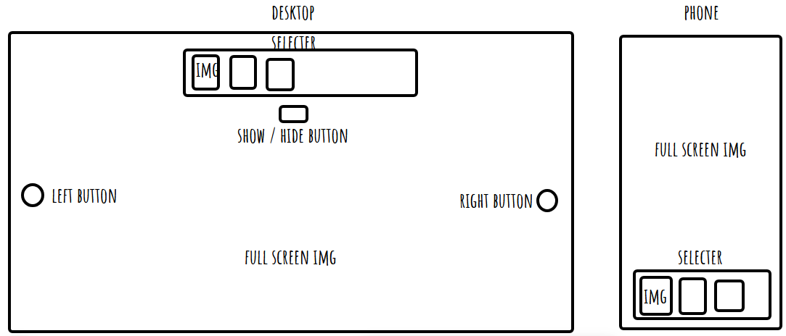
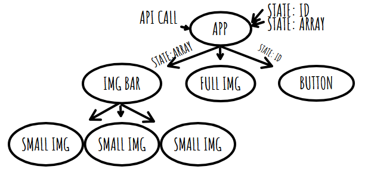
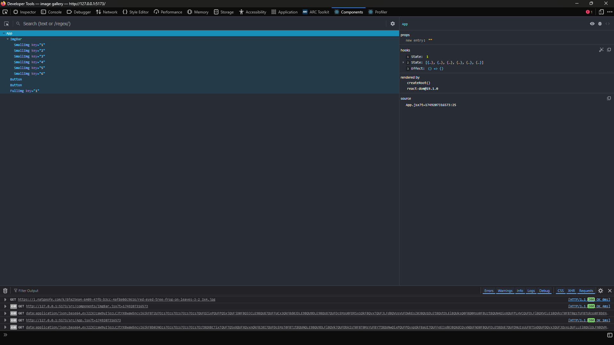
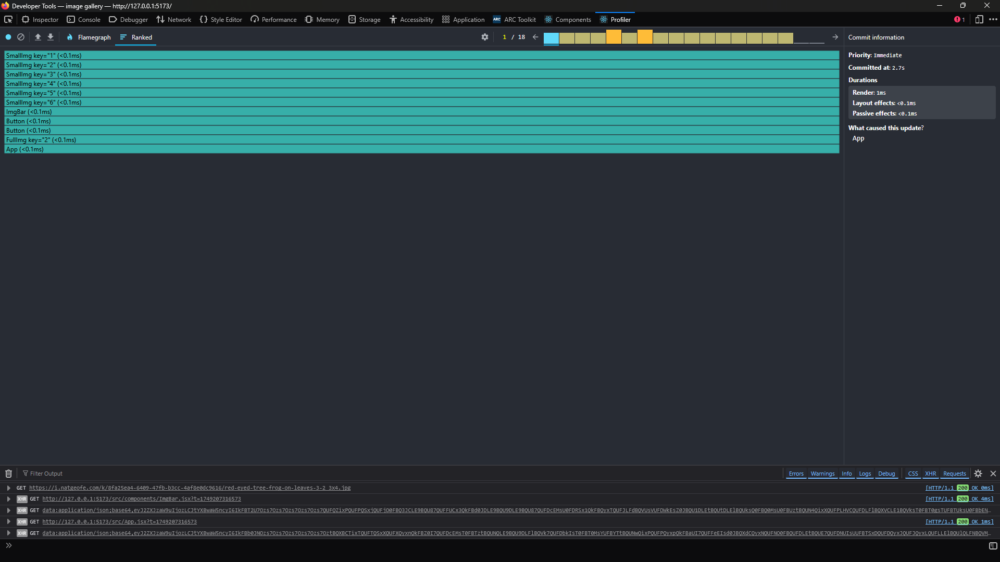
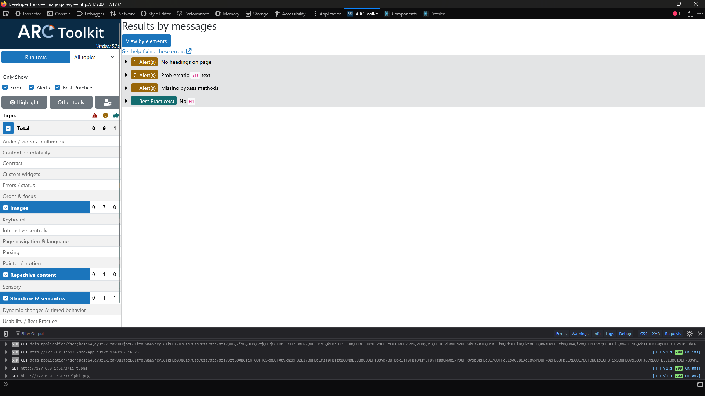

# week 3 assingment

## Reflection

- basic requirements

  - use useState - done ease
  - Use useEffect - done ease
  - multiple components - done ease
  - Use .map() - done ease
  - display a larger image when thumbnail is clicked - done eaase
  - all images have alt text - done ease
  - keyboard navigation - done ease

- stretch goals
  - Use useEffect and the dependancy array to update the images when the user types in an input field.
  - Set up an Unsplash application - nope dont undestand there documentation
  - Use .env - done ease
  - Styleing - done with pain - joe help me

## References

- i use okso.app to help make a layout and site flow
- i use https://tailwindcss.504b.cc/ to help with styleing
